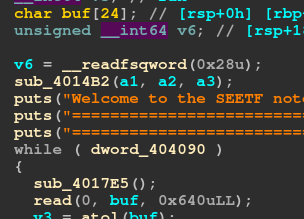
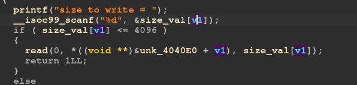
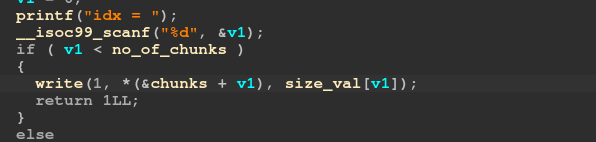

# mmap challenge - ROP

## Bugs:

* There is an obvious buffer overflow bug in the main function. We abuse this to do a rop chain.

* There is a not so obvious bug which will allow us to read arbitrary number of bytes. As in the write function it is taking the input and checking the condition but is not nulling out the value after check fails. 
* This leads to an arbitrary read in read function.

write function:

Read function:

Exploit:

Brute force the selection of the mmaped region which is closest to the TLS region. As the canary is present in the Thread Local Storage. Our plan is to leak the canary from there. Finally write a ROP chain to mmap a region with the FD of open("/flag").