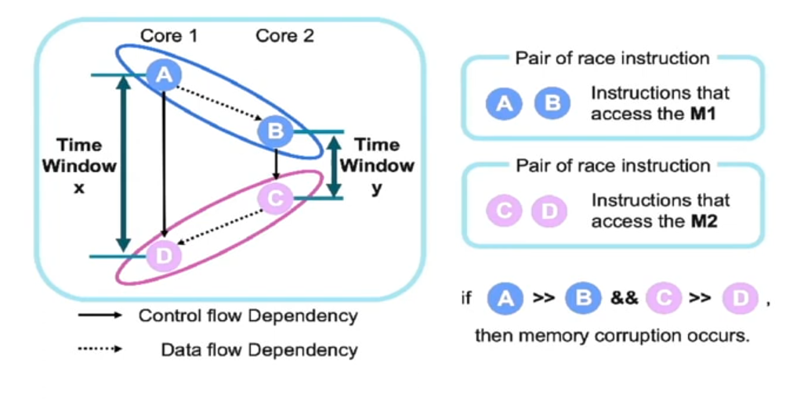

# What is Race Conditions:

## time of Check/ time of action:
- If there is a check() and do_something() in a program that brings about a change in the environment.
- Incorrect usage of the specific program by multiple process/ threads can lead to race condition if there are no mutex locks. 
- Since the p1:check(), p1:do_something() can intermix with p2:check() p2:do_something() hence abusing the program in some way. 
- motivation: try to increase the time window so our attack would be successful.

## Abusing the concurrency:
- Identify the weak points between functions(a check() and do_something() ) in the process.
- It is about changing the state the program is running in. 
- Its about winning the race. FileSystem is a massive place where we have multiple acces to the **same shared resources.**

## Process and thread:
- Process is basically a whole program being excecuted.
- Thread is like a subdivision and resources are shared between threads and are spawned inside a process. 
- fork() --(successor)--> clone()

## libc vs raw syscall discrepency.
- posix standards says: setuid to set all the threads to the same uid (libc wrapper) whereas the system call for the setuid will only apply the uid to the particular thread.
- exit libc call will call exit_groups which is not the same as exit().

## Single Variable vs Multi variable RC:
- Single Variable: A variable is shared between 2 threads/ process and is manipulated in that Race condition tiome window. 
- Multi variable: 2 variables are in the time window.

## TLB shootdown:
- Translation lookaside buffer:
    - If the virtual to physical mapping is changed, it tells all other threads through tlb to invalidate that mapping.
    - TLB flushing is tlb shootdown.
- Using cpu interrupts we can slow down the process of race time window. 

## ref: 
- https://pwn.college/cse466-f2022/race-conditions
- https://www.youtube.com/watch?v=5M3WhLVLCzs&ab_channel=BlackHat