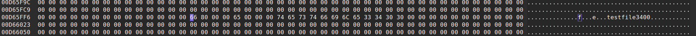
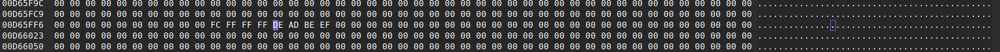
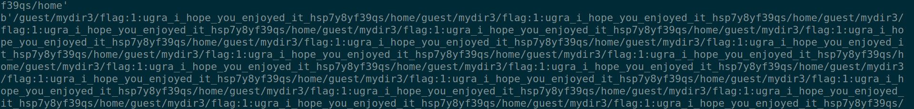

## Challenge: VFS

## Post solve (reading writeup): 

- Directory structure is treated the same way as the file structure. So This can be taken advantage in the race condition.
- We use grep to read through all the files in the directory, meanwhile we race to free the file in the continuous block which holds the information for the files in the directory. 

- 1 block: 170 entries:
    - you create multiple blocks to slow down the process for `grep` to reach the n'th block So that in another instance you can manipulate the directory contents by removing and replacing with a file.  

**Stage 1 : actual Directory block containing the name of the file in the order.**



**Stage 2 : Overwritten direcrtory block index**



# In the server.


# High Level Overview of Most functions:
## get_absolute_path:
- components is empty vector (if path starts with '/'). Gets the correct CWD of the location, nothing intresting ?
- always gives the path starting with /. 
- intresting: Will pop stuff if there is `..` in the components. What happens if you pop more stuff than what is already there in the components. rust handles the underflow in this case.

## resys:
- just deleted the file data/filesystem.vfs.
- exit()

## cd:
- new_cwd: get the path, should start with /.

    ### read_directory/ read_directory_by_block:
    - Can't specifically understand how the iterator functions here.

    ### traverse_path:
    - entry:
        is_directory: true,
        owner_uid: 0,
        others_can_read: true,
        others_can_write: false,
        contents_block_index: self
            .get_root_block_index()
            .context("while retrieving root block index")?,
        filename: "/".to_string(),
    - recursively reads the filename seperated by `/` and checks if it exists.
    - Starts from the root directory or `/`.

    #### get_root_block_index:
    - super_block: 0th block (head).
    - returns the index of the root block.

    - Finally updates the self.cwd to the correct value.

## ls:
- Nothing intresting just uses already existing info in the entries to display the filename and their permissions.

## cat:
- basically spit stuff from the path given.
    ## readfile:
    - does read_file_by_block after doing all the required checks from traversing the path.
```
for chunk in iterator {
	let chunk = match chunk {
	    Ok(chunk) => chunk,
	    Err(error) => {
	        println!("cat: {error:?}");
	        return Ok(());
	    }
	};
	io::stdout().write_all(&chunk)?;
}
```

- write_all will wait until the entire thing is written to stdout.

## alloc_block:
- gets the super block, ... Kinda works like dynamic memory allocator.
- super block as the first free block index.
    - use that block to allocate the new stuff
- get the index of next free block stored in the first 4 bytes. 
- if the next_free_block == 0:
    - next_free_block = free_block + 1
else:
    - next_free_block = 0

## free_block:
- get the root of the link list and append a new top which is the newly freed block.
- safe to use

## stat:
- Simply gives out information on the particular file.
- Not much user controlled data. So not delving much into it.

## find:
- get the absolute path. Traverse the path.
- recursively go through all the components in the path and spit it out to stdout. (walk)

## grep:
- Does the same as find but will look at the data in the block also.
- uses walk for assistance.

## Write:
- This function is most SUS to me idk why. Is it because it allows you to write to the read only files and overwrite the flag.txt :P

## conclusion:
- Everything is stored in the filesystem.vfs:
    - the index of where the contents are stored.
    - file permission.
    - file name and everything.
- Each block is about 4096 bytes.
- Race Condition since multiple instances for the same file system with no mutex locks.


## Ref:
- https://github.com/teamteamdev/ugractf-2024-quals/blob/master/tasks/vfs/WRITEUP.md