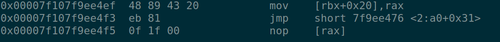
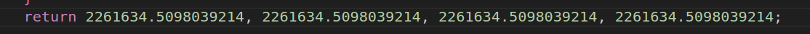
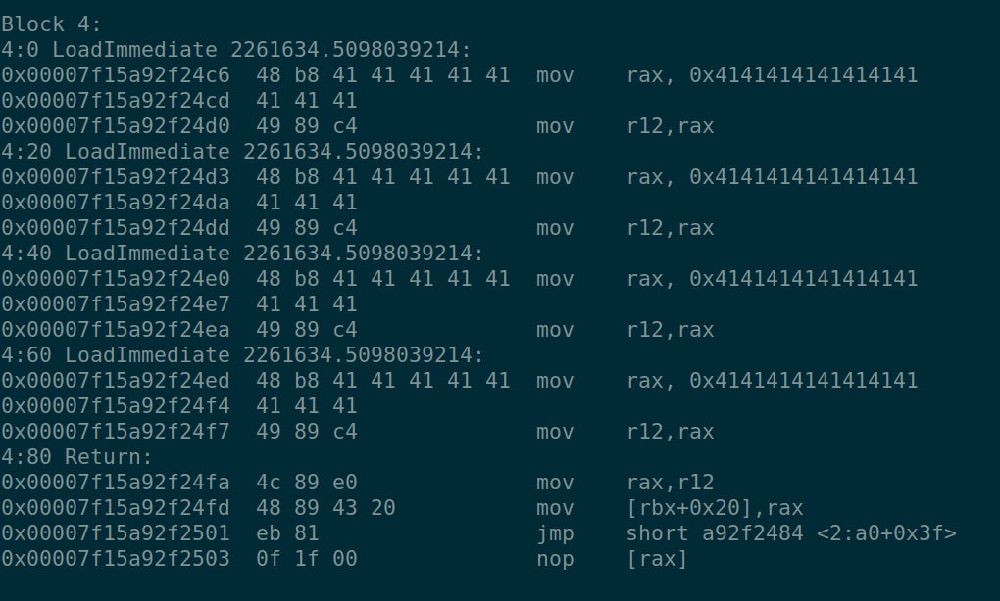

# Hop

## Build:
- Clones the serenity os repo and gets the js engine to excecute the js file we give.

## Patch:
- If the jump offset is within -127 and 127 and *was a jmp rel(16/ 32):
    - it creates the instruction as jmp rel8 followed by a 2 byte instruction: NOP and null byte.
- else:
    - normal relative jump followed by 4 bytes of offset.

- Offset is incremented by 3 since they reduce the instruction set of jmp rel16/rel32 to jmp rel8. (3 bytes of NOP instructions.)

## Bug:
- Since the offset is incremented by 3, and casted to a signed character it can have an integer overflow. So instead of jumping 3 bytes forward its sign changes and jumps backwards.

- Once it goes into the if condition, it will jump back to the common_exit, prolly for the end of the function(not sure why). So it will use a relative jump, this is where the patch comes into play and does a rel8 jump as its not that big (< (127)). 
- So if the offset is 127, 126, 125 then it will add 3 to it and make the offset a negative number, hence control flow hijacking.  

- Often, even in x86 the RIP points to the next instruction, So offset = (offset_in_instruction_stream - off_of_label), He quick patched offset+3 to cover up for the 3 NOP instuctions.
    - In this case the Difference comes upto 126 and when you add 126+3 it becomes a negative number specifically (Sets the signed bit): -127.
    - 0x7f9ee476 - 0x7f9ee4f5 = -127.

- If you kinda  know what js code corresponds to assembly you can kinda modify and make the distance between common_exit and function rturn to be 127, 126, 125.

- The floating values gets converted to its specific IEEE format as used by the x86 assembly architecture.
- Constructing the Shellcode:
    - relative jump instruction will take 2 bytes. (\xeb \xoffset)
    - 6 bytes of our shellcode with padded NOPs.

## Shellcode:
- Not my own shellcode, Since did'nt get the time to write my own. Chovid's wonderful script Gave a shellcode that would jump back to its original start of shellcode from the bottom and would perform a jump $7 to skip the inbetween opcodes/ instructions.

## Reference:
- https://chovid99.github.io/posts/dicectf-2024-quals/#hop  orz