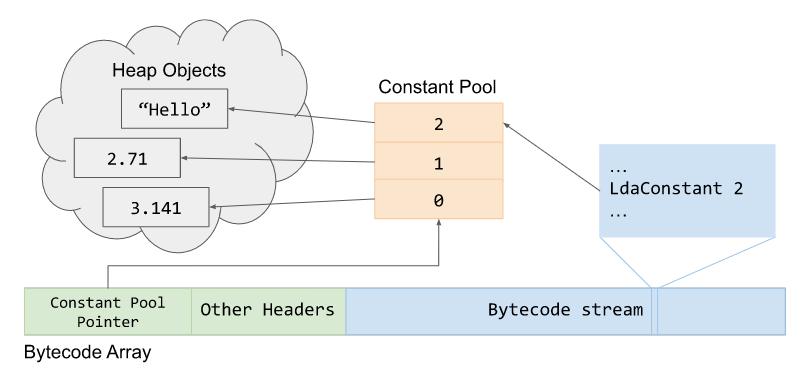

# General

> Blink is responsible for the rendering and it uses many libraries including v8 for running/interpreting javascript.

## Isolate and context:
- isolate: Javascript execution environment - contains heap manager, garbage collector. (thought of instance of v8)
- context: global root object that holds info on the state of the vm. one window object corresponds to one context.
- each time js has to be excecuted it needs to check if the context is correct.

## Ignition interpreter:
- js code -> (parser) tokens -> (parser) AST -> (ignition) byte code <-> optimization by turbofan.
- when ignition compiles the byte code, additionally it collects profilling and feedback data while a function is run.
- This feedback is given to the turbofan to make jit optimised code.
- Register based machine.
- each bytecode has its own handler - assembly code.
- Ignition design: https://docs.google.com/document/d/11T2CRex9hXxoJwbYqVQ32yIPMh0uouUZLdyrtmMoL44/edit#heading=h.l7nrslsveniq
- the register file is in the stack frame created by the `InterpreterEntryTrampoline` stub.
- the accumulator register is not the stack frame because it will change constantly so its kept in the interpreter as a state register.
- stack pointer, program counter and accumulator is pointed by the frame pointer in the stack frame (isolate context).
- also each bytecode is just an enum where the index corresponds to the corresponding handler.
- Constant pool - keeps track of all the heap objects initiated in generated bytecode like strings constants.

## Sparkplug:
- very fast non optimizing compiler - converts the ignition byte code to machine code to run it natively (does'nt produce the IR).
- It basically serialise the interpreters excecution by calling the same builtins: this helps the js code to be faster as no opcode decoding and lookup for builtin is required.    
 
## TurboFan:
> profiler: works ahead of time by watching code that should be optimized. JIT is bascially watching the code and optimizing the hot code.

### JIT:
- speculative optimization: the optimizing compiler looks at the type feedback from the profiler and makes assumptions to make the jit compiled code faster.

### speculative optimization and type guard:
- why ?
    - evaluating a expression according to the ecma standard is pita.
    - have to follow lot of checks and finally get the value for given expression.
- Turbofan kicks in assumes the type of the data by relying on feedback vector.
    - BinaryOp basically points to speculations/feedback.
    - invocation count keeps track of the numeber of times the function ran.
    - Type Confusion: tricking the jit code built on our speculation by giving a different type. Hence type guard is put in place to check if the type has changed. (map check)
    - if the type guard fails then it will just follow the unoptimized code. Also the checks make sure its within the bounds.

### Sea of nodes:
    - SSA:  each variable be assigned exactly once.
    - Graph form
    - this helps turbofan to get data flow analysis and machine code generation.
    Colours of **nodes**:
    - Yellow: Can change the 'flow' of the excecution script.
    - light blue: value a certain node can have, return.
    - red: operator overloaded functions.
    - blue: VM level operations such as allocation, bounds check.
    - green: single machine level instructions. might also be a type guard.

    Types of **Edges**:
    - Control: conable branches and loops.
    - value: these show value dependecies and output.
    - effect: reading or writing states.

    - if the speculativenuberlessthan if its more than 10k (not sure why) it will bail out as it does'nt satisfy the type given.

### Optimizations:

#### Typer phase:
    - This is run by OptimizeGraph.
    - Whenever there is a builtin function call it associates a type with it.
	

# refs:
- https://jhalon.github.io/chrome-browser-exploitation-1
