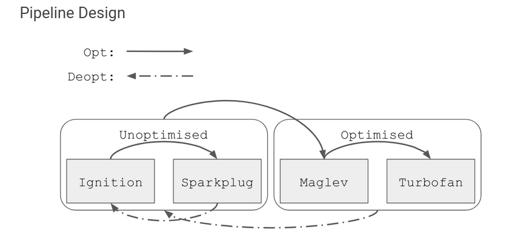

# Maglev and CVE-2024-0517

## What is Maglev:
- Inbetween optimizing compiler which is after sparkplug and before turbofan. It mainly relies on the feedback from the interpreter.
- Also generates a control flow graph with nodes called the maglev IR.
- Prepass:
    - Analyse through the bytecode and then find the braches and loops.
    - Collect liveness information 
- During graph building it will look at the feedback and will create SSA nodes for the types observed.
    - Additionally it will make a side node that it knows to type of the shape of object, which saves a lot of time.
    - Same like the turbofan compiler this will make sure to deoptimize once the shape of the object has been changed.

## CVE-2024-0517
- 

## What is ubercage:
- V8 sandbox that tries to enforce memory read and write even after a succeful v8 exploit. Doesnt allow writes beyond the v8 heap sandbox.
- Even the full pointer to the backing store in ArrayBuffer is removed. Finally the pointers to code execution are stored in a table of pointers, kinda like webassembly ig.

### Ref:
- https://blog.exodusintel.com/2024/01/19/google-chrome-v8-cve-2024-0517-out-of-bounds-write-code-execution/
- https://v8.dev/blog/maglev
- https://docs.google.com/document/d/13CwgSL4yawxuYg3iNlM-4ZPCB8RgJya6b8H_E2F-Aek/edit