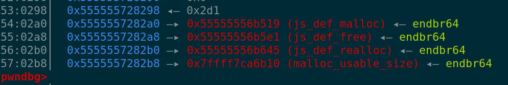

# CVE-2023-4863 in quickjs - iswebp.js

## Huffman coding:
- lossless compression: no data is actually lost while compression and decompression.
- Single symbol - single binary code.
- Using frequencies of the symbols to map certain bits to certain symbols. 
    - huffman encoding tree: basically a tree made using the highest frequescies being on the top and others following it.
    - priority queue to follow a order in the symbol tree.
    - Modern methods use a table instead of a tree.
- In short: Higer frequencies will have a shorter code and less frequent symbols have a longer code.
- main idea: Use a variable length code to represent a symbol. Makes sure that the prefix is not repeated for other symbol lookup.
- Generate table:
    - Each entry in the table will have a 8 bit mask ans code to perform bitwise operation on the given input and get the appropriate code to represent a symbol.
    - multi-level lookup: Since just having 1 table will take up a lot of space as there is redundancy.
        - So each table (9 bit lookup) will have a further pointer to another table to make the search more efficient.

### Bug:
- VP8L: Lossless compression support for the webp image files. (Uses huffman encoding).
    - Calculates how big the table can get before hand. If the total size is bigger it will just allocate a new buffer.
- libwebp.patch:
    - They comment out the freeing of the huffman_table. No idea what this can do.
- quickjs.patch:
    - disable all the system modules.
    - iswebP:
        - receive a UINT8_ARRAY type object and decodes it into webp by giving it into the decodewebp.
    - gc:
        - trigger the garbage collector for better stable exploits.

### Initial OOB write:
- Heap spray to make future allocation in the desired location. In our 0x2fc0 freed chunk which was our old ArrayBuffer. 
- The malicious webp will make a write on chunk+0x3000 a value of 0x30007. This can be used to overwrite a length field in an float64Array.
- Which will lead to unlimited oob. From here we can control the backing store of the float64array hence a arbitrary write/read primitive.

### Control Flow Hijacking:
```
struct JSRuntime {
    JSMallocFunctions mf;
    JSMallocState malloc_state;
    ...
}
typedef struct JSMallocFunctions {
    void *(*js_malloc)(JSMallocState *s, size_t size);
    '''
```



- This RunTime structure is stored in the heap and has function pointers that gets called when Array object is create (inside the JSMallocFunctions - mf).
- JSRuntime->mf : heap_base+0x2a0
- JSRuntime->malloc_state : heap_base+0x2c0

- Finally just making an allocation will trigger malloc with the malloc_state which will call the system("xcalc").

### Resources used:
- https://velog.io/@0range1337/CTF-ASIS-CTF-Final-2023-isWebP.js-Exploiting-QuickJS-by-Webp-Vulnerability
- https://blog.isosceles.com/the-webp-0day/
- https://chovid99.github.io/posts/asis-ctf-finals-2023
- https://www.darknavy.org/blog/exploiting_the_libwebp_vulnerability_part_1/